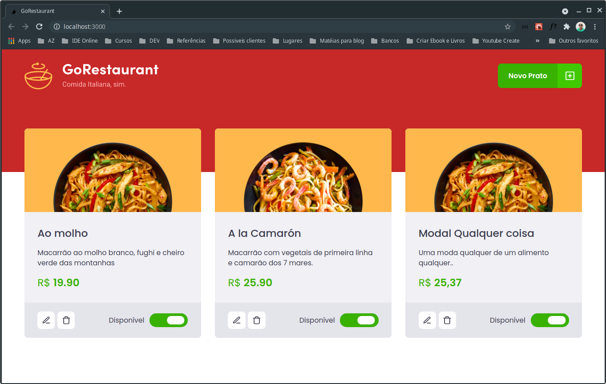
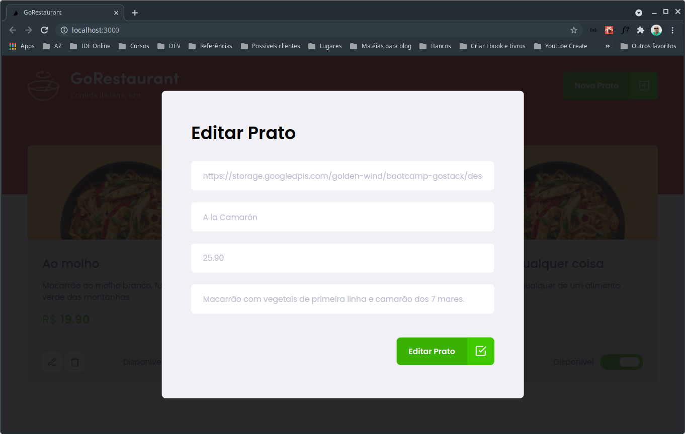
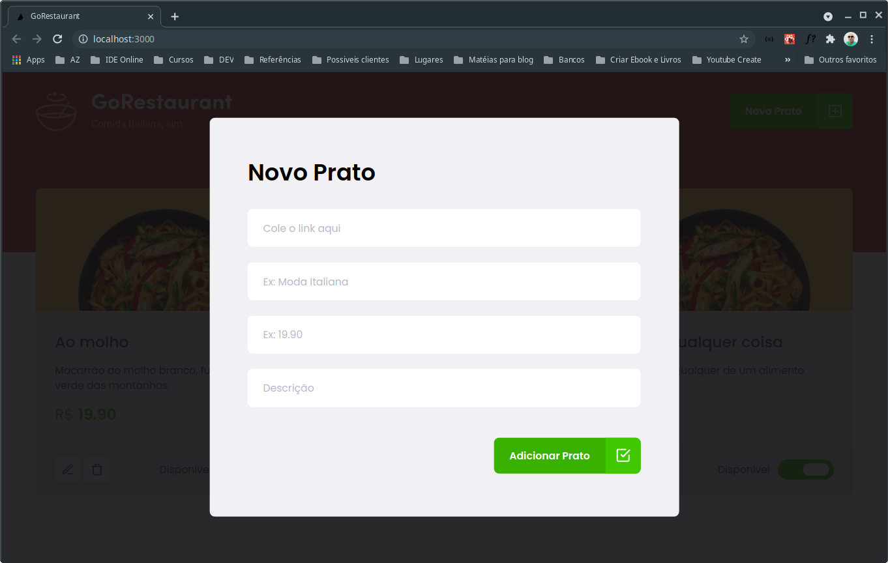

# GoRestaurant

<h1 align="center">
			Desafio 02 - Refactoring de classes e typescript
</h1>

<br />

<h3 align="center">
    Desafio 02 refatorando componentes de classes para função e de javascript para typescript. [Chapter II]
</h3>

<br />

<p align="center">
  

  

  

  

  <a href="https://github.com/andrelinos/ignite-reactjs-refactoring-classes-ts/commits/master">
    
  </a>

  <a href="https://rocketseat.com.br">
    
  </a>

</p>
<br />


Tabela de conteúdos
=================
<!--ts-->
   * [Sobre o projeto](#-sobre-o-projeto)
   * [Funcionalidades](#%EF%B8%8F-funcionalidades)
   * [Layout](#-layout)
   * [Como executar o projeto](#-como-executar-o-projeto)
     * [Pré-requisitos](#pré-requisitos)
     * [Rodando a aplicação](#-rodando-a-aplicação)
   * [Tecnologias](#-tecnologias)
   * [Autor](#-autor)
   * [Licença](#-licença)
<!--te-->


## 💻 Sobre o projeto

Aplicação já funcional, pelo menos que no que se propõe a fazer, que é o gerenciamento de pratos. Porém, ainda pode ser inclementado para desempenhar outras funções, como propostas abaixo:

---

##  ⚙ Funcionalidades
### Painel de controle - Restaurante
- [x] Adicionar prato
- [x] Alterar detalhe do prato
- [x] Marcar/Desmarcar como disponível
- [x] Deletar prato
- [ ] Página inicial para acesso público
- [ ] Função para pesquisar por pratos
- [ ] Fazer pedidos
- [ ] Sacola de pedidos
- [ ] Histórico de pedidos
- [ ] Lista de clientes

### Painel de controle - Cliente
- [ ] Cadastro
- [ ] Controle de acesso
- [ ] Endereço de entrega
- [ ] Histórico de pedidos

---

## Telas

<p align="center" style="display: flex; align-items: flex-start; justify-content: center;">
  
</p>

<p align="center" style="display: flex; align-items: flex-start; justify-content: center;">
  
</p>

<p align="center" style="display: flex; align-items: flex-start; justify-content: center;">
  
</p>


---

## 🚀 Como executar o projeto

### Pré-requisitos

Necessário para executar o projeto:
- [Git](https://git-scm.com)
- [Node.js](https://nodejs.org/en/)
- [VSCode](https://code.visualstudio.com/) (opcional)

#### 🌎 Clonando o projeto

```bash

# Clone este repositório
$ git clone https://github.com/andrelinos/ignite-reactjs-refactoring-classes-ts.git

# Acesse a pasta do projeto no seu terminal/cmd
$ cd refactoring-classes-ts

# Instale as dependências
$ yarn # ou npm install
```

#### ⚡ Executando servidor
```bash
# Execute o server
$ yarn server # ou npm run server

# O server estará rodando na porta:3333 - acesse http://localhost:3333

```

#### ☄ Executando a aplicação

Com o repositório clonado anteriormente, é preciso somente executar a aplicação agora.

```bash

# Execute a aplicação em modo de desenvolvimento
$ yarn dev # ou npm run dev

# A aplicação será aberta na porta:3000 - acesse http://localhost:3000

```

---

## 🛠 Tecnologias

As seguintes ferramentas foram usadas na construção do projeto:

-   **[React](https://reactjs.org/)**
-   **[Typescript](https://www.typescriptlang.org/)**
-   **[Axios](https://github.com/axios/axios)**
-   **[react-icons](https://react-icons.github.io/react-icons/)**
-   **[react-modal](https://github.com/reactjs/react-modal)**
-   **[react-router-dom](https://reactrouter.com/web/guides/quick-start)**
-   **[styled-components](https://styled-components.com/)**
-   **[polished](https://polished.js.org/)**
-   **[unform](https://unform.dev/)**


> Veja o arquivo  [package.json](https://github.com/andrelinos/ignite-reactjs-refactoring-classes-ts/blob/master/package.json)

---

## Autor

<a href="https://app.rocketseat.com.br/me/andrelinosilva">

</a>

- [Rocketseat](https://app.rocketseat.com.br/me/andrelinosilva) 💜
- [LinkedIn](https://www.linkedin.com/in/andrelinosilva) 🔗
- [Github](https://github.com/andrelinos) 🚀
